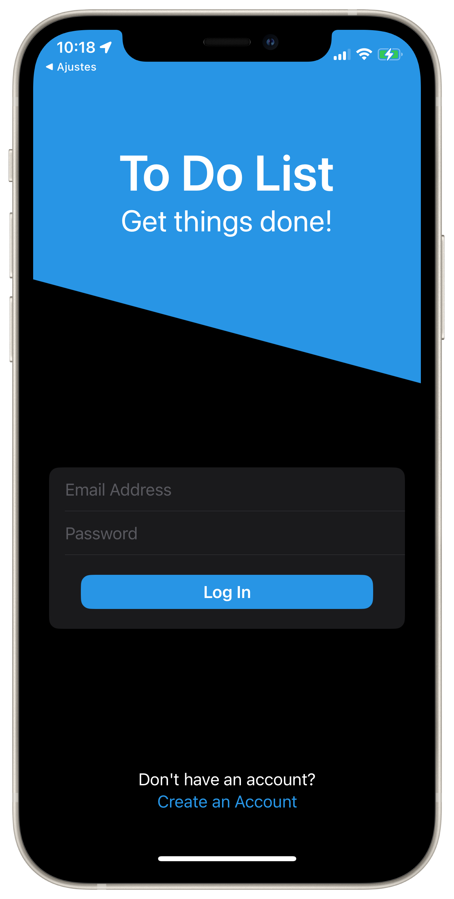
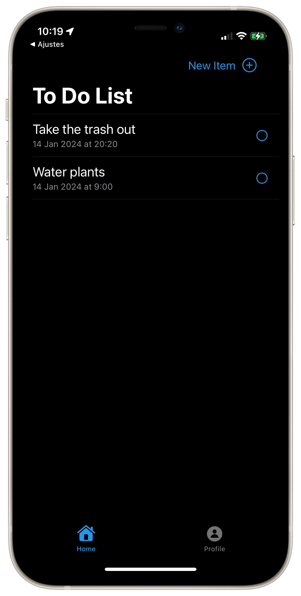
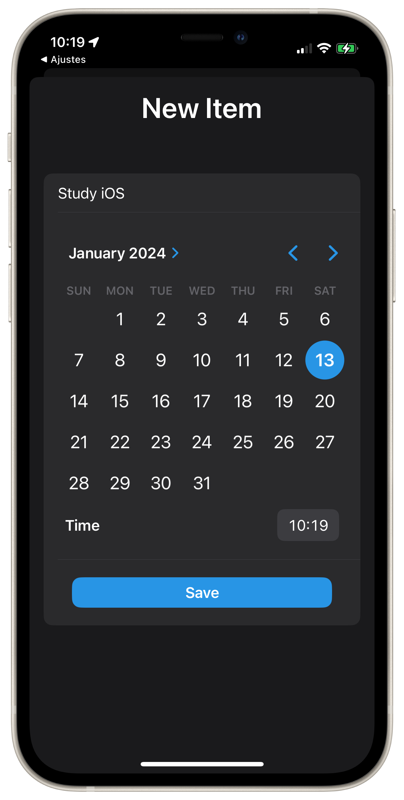
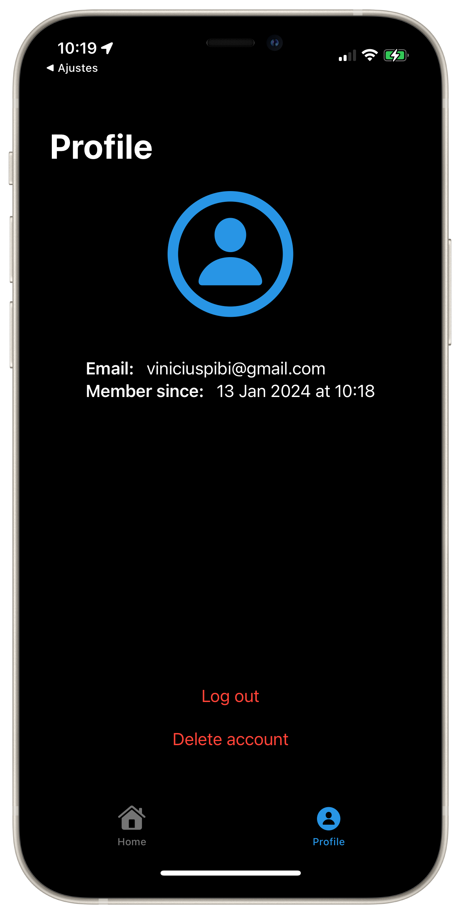

# ToDo List SwiftUI iOS App

 Personal project made for learning purposes.
 The project was made in [Xcode](https://developer.apple.com/xcode/) using the [SwiftUI](https://developer.apple.com/xcode/swiftui/) framework and [Firebase](https://firebase.google.com/), and follows the MVVM architectural patern.

    
    
    
    

 
 
 

